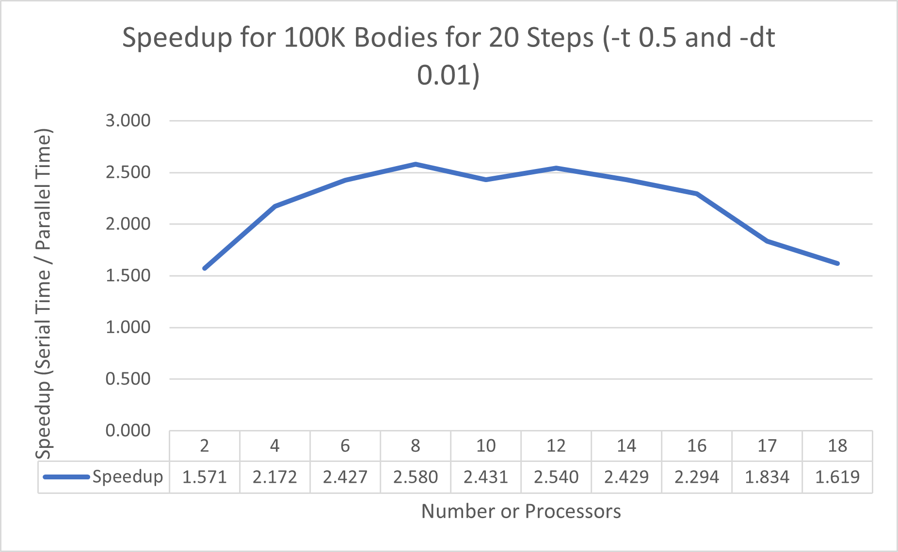
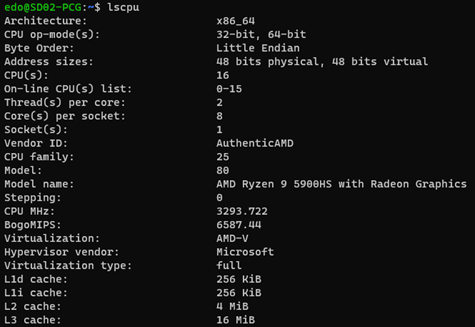

# Message Passing Interface (MPI) with Barnes-Hut Algorithm

## Visualization Intro
https://github.com/edochang/mpi-barnes-hut/assets/8861870/13d3796b-55a8-4c20-94b7-5490fb726dc7

The visualization above was ran by running the following terminal command:

    mpirun -np 10 ./bin/nbody -i input/nb-10.txt -o ./output/nb-10-out.txt -s 20000 -t 0.5 -d .01 -v

## Approach to Parallelizing Barnes-Hut Algorithm 
The first approach I took before attempting to parallelize the N-Body Barnes-Hut Algorithm was to understand the algorithm itself and then write the sequential version of it.  The sequential version will be needed to evaluate the gains from MPI parallelization.  The algorithm can be broken down into the following key components:
-	A data structure to represent the Barnes-Hut Tree.  In this lab, it is a Quad Tree representing a 2D space from 0 to 4 on both the x and y axis.
-	A data structure to represent a particle / body.
-	A function to insert bodies into the tree and determines if the tree needs to expand to place particles in the right quadrants.
-	Logic to calculate center of mass.
-	A function to calculate the net force acting on a body.
-	A function to calculate the new x and y positions based on the forces acting on the body using Leapfrog-Verlet Integration
-	[Optional] Saved for last was the visualization to observe the algorithm and its affect on the bodies position.

After completing the sequential version of N-Body Barnes-Hut, I proceeded to analyze my implementation on how to enable processes with the same algorithm and logic to communicate and cooperate on the work.  I selected 3 key areas in the algorithm and measured the sequential processing time for each section using the 100K body dataset.

|Section                    |Time                  |
|---------------------------|----------------------|
|Tree Creation              |275.949 milliseconds  |
|Net Force Calculation	    |2,247.303 milliseconds|
|Leapfrog-Verlet Integration|1.172 milliseconds    |

Note: Run Time is based off the following run parameters

    mpirun -np 1 ./bin/nbody -i input/nb-100000.txt -o output/nb-100000-out.txt -s 1 -t 0.5 -d 0.01

From a top to bottom priority order, the areas worth parallelizing are…
1.	Net Force Calculation
2.	Tree Creation
3.	Leapfrog-Verlet Integration

In terms of which area is easier to implement parallelization, I suspected it would be the Net Force Calculation and Leapfrog-Verlet Integration because the division of work will be the same, meaning we will interject communication between the steps to sync all processes.

With that said, at the beginning of the run, I chose to broadcast the number of records to each process, since only one process (root / main) will read in the input file and will know how many records are in the input file.  From there, the root / main broadcasts the body of vectors to all processes to work on.  As hinted before, the Tree Creation will be more difficult to parallelize as there’s a level of dependency between bodies in placing them in their respective space in the Quad Tree (at the very least with my approach / logic there’s dependencies).

From there all I had to do was do an allgatherv communication after the Net Force calculation and the Leapfrog-Verlet integration.  Do note that there’s a drawback to this approach.  The number of processors cannot be more than the number of bodies, because then some processors will be idle and allgatherv will not work with this model.  However, with MPI you shouldn’t have idle processes in real-world use cases, because MPI connected machines are expensive for the power you’re trying to utilize with clusters of machines.

## MPI Parallelization Performance
With the program setup, let’s observe the execution time.  Note 10 bodies was more useful for testing the solution / implementation than for testing performance.  The execution time were too fast to observe behavior.  With that said, let’s look at the 100 and 100K bodies dataset.

### 100 Bodies
With the following run configuration:

    -s 1000 -t 0.5 -dt 0.01

I observed the following behavior.

You can see that the time gradually increases as more processes are added.  I speculate this is showing the communication overhead that is required to pass and sync data to all processes.

Finally, you might notice why I am observing a 17-processor run.  I speculate that the performance would degrade with the machine I am running this test on.  My machine has 8 physical cores and with hyper-threading it can have 16 total logical cores.  Given that we have added an extra process that’s not supported by the hardware, we can see the scheduler struggling to process the extra 1000 instructions across all its logical processes.  This explains why the MPI architecture support horizontal scaling.  If you are utilizing more than what your machine has to offer, you can setup a machinefile that lists out all the network connected machines to gain more cores / processors.

Now what happens if we increase the run to 5000?

    -s 5000 -t 0.5 -dt 0.01

Here, I observed consistent run times across all processors.  Again, I speculate there’s a tradeoff here where the communication overhead is not beneficial if you’re use case is to process a low volume of data in your algorithm or simulation.

### 100k Bodies
Let’s look at the performance when we are processing a large dataset (e.g., 100K bodies).  I will start with the following run configuration:

    -s 20 -t 0.5 -dt 0.01

I chose 20 iterations to start, because the dataset is very large to run instructions multiple times.  We can observe in another run configuration on what happens if steps are doubled.

In this run, we can see that run time improves as we add more processors to split the work of calculating the force and Leapfrog-Verlet Integration.  However, we see that we don’t get many gains after 8 to 12 processors and it actually degrades when we fully stress out the scheduler when trying to hyper-thread by using all logical cores.  I speculate from these two things:
1.	Hyper-threading is not beneficial for my application program.
2.	Potentially additional configuration or setup is required on the infrastructure, framework, and libraries to assist the scheduler in handling a program that requests to use more cores above the physical core limit (go from physical cores to also including logical cores).

Let’s look at this behavior differently with Speedup.

Here we can easily observe that the peak performance is the physical 8 core.  When observing the behavior of MPI and the algorithm, I’ll be using 8 processors as the baseline.

Let’s see what happens if we double the steps.

    -s 40 -t 0.5 -dt 0.01

The behavior / trend is the same.  A small improvement is observed at 12-processors.  I believe the scheduler was able to optimally schedule the instructions in that single run.  In terms of consistent and expected behavior, this doesn’t deviate my conclusion that physical cores are going to be more optimal over hyper-threading with logical cores.  Even with this observation, 8-processes beats all others except 12.  

This can be supported if we look at the 20-steps run again and look at the speedup efficiency with the following algorithm:

$$ \frac{Time_{sequential}}{(Porcessors * Time_{parallel})} $$

|2    |4    |6    |8    |10   |12   |14   |16   |17   |18   |
|-----|-----|-----|-----|-----|-----|-----|-----|-----|-----|
|0.786|0.543|0.404|0.322|0.243|0.212|0.173|0.143|0.108|0.090|

This is a tradeoff that should be considered when sizing MPI machines.  The value diminishes as we increase more and more processes on a single machine, so I speculate for larger clusters, it’s worth checking if it’s more valuable for clusters to be configured to utilize one application thread per physical core.

#### Behavior of theta and dt
For dt, I observed the behavior of this for 10 and 100 bodies and didn’t think it was worth observing this in the 100K run, because this parameter just multiplies the end results and doesn’t dictate / direct the program on how it should read / traverse the Barnes-Hut Tree.  However, Theta is a different story.  Theta directs the program whether it needs to consider each body’s mass to influence the Net Force impact on the body of interest or if a center of mass will be used instead (or in Barnes-Hut terms whether a subtree will be used).  If a subtree isn’t used because the space length over the distance between the body and center of mass is greater than theta (indicates the body isn’t far enough to use the center of mass), then the program will need to traverse through the tree to get the actual mass and position.
With the following run configuration:

    -np 8 -s 20 -dt 0.01

I observed the following behavior when adjusting theta.

As you can see, as we increase the theta threshold, the program will use the center of mass more frequently than using the individual bodies that make up the subtree.  Again, when it doesn’t use the center of mass, it’ll traverse through the subtree to get the individual body masses and positions.

#### MPI Communication Time
In previous sections we brought up that communication overhead / bottlenecks (e.g., latency and bandwidth limitations) could be a suspect for not seeing big gains when you increase the number of processors.  What does the communication time look like for a 100K body run?  

The following observation was gathered for 2 processors:

|Communication                                      |Time|
|---------------------------------------------------|----|
|Broadcasting Number of Records                     |12.333 microseconds|
|Broadcasting 100,000 bodies using a vector buffer  |Send: 5629.667 / Receive: 4234.667|
|Allgatherv 100,000 bodies between processes (gather and broadcast pattern) for Force Calculation                      |~3100 to ~3600 microseconds|
|Allgatherv 100,000 bodies between processes (gather and broadcast pattern) for Leapfrog-Verlet Integration Calculation|~2087 to ~2065 microseconds|

What sticks out in this observation is the run time for Allgatherv for the Leapfrog-Verlet Integration Calculation.  The amount of time for a sequential / single processor to run this calculation is 1,172 microseconds which is ~900 microsecond less than the communication!  I speculate if I changed this pattern to just a broadcast, I could gain some efficiencies when scaling the number of processors.  In conclusion, I speculate that certain parts of an algorithm are worth utilizing MPI parallelism and in this case it’s the more costly operations such as tree building or the force calculation.

I didn’t have time to explore other MPI communication patterns, but I speculate I could have reduce the communication over head if I used a smaller send buffer versus using the same large buffer of 100K bodies, in addition to not splitting and communicating Leapfrog-Verlet calculations.

# Appendix

## Computer Information
AMD Ryzen 9 5900HS with Radeon Graphics, 3301 Mhz, 8 Core(s), 16 Logical Processor(s)
Installed Physical Memory (RAM): 24.0 GB

### lscpu on WSL2 

### OS Version 
Windows 11 Pro, Version 22H2, OS Build 22621.608
Windows Subsystem for Linux Distributions:  Ubuntu-20.04

    uname -r >>> 5.15.57.1-microsoft-standard-WSL2

### MPI Version 

    mpic++ --version
    g++ (Ubuntu 9.4.0-1ubuntu1~20.04.1) 9.4.0

    mpirun --version
    HYDRA build details:
        Version:                                 3.3.1
        Release Date:                            Wed Jun  5 14:57:33 CDT 2019
        CC:                                      gcc
        CXX:                                     g++
        F77:
        F90:
        Configure options:                       '--disable-option-checking' '--prefix=/usr/local/mpich-install' '--disable-fortran' '--cache-file=/dev/null' '--srcdir=/home/edo/libraries/mpich-3.3.1/src/pm/hydra' 'CC=gcc' 'CFLAGS= -O2' 'LDFLAGS=' 'LIBS=' 'CPPFLAGS= -I/tmp/mpich-3.3.1/src/mpl/include -I/home/edo/libraries/mpich-3.3.1/src/mpl/include -I/home/edo/libraries/mpich-3.3.1/src/openpa/src -I/tmp/mpich-3.3.1/src/openpa/src -D_REENTRANT -I/tmp/mpich-3.3.1/src/mpi/romio/include' 'MPLLIBNAME=mpl'
        Process Manager:                         pmi
        Launchers available:                     ssh rsh fork slurm ll lsf sge manual persist
        Topology libraries available:            hwloc
        Resource management kernels available:   user slurm ll lsf sge pbs cobalt
        Checkpointing libraries available:
        Demux engines available:                 poll select

## Running The Program
Run the following in the terminal:

    mpirun -np 16 ./bin/nbody -i input/nb-100000.txt -o output/nb-100000-out.txt -s 40 -t 0.5 -d .01 && mpirun -np 16 ./bin/nbody -i input/nb-100000.txt -o output/nb-100000-out.txt -s 40 -t 0.5 -d .01

**./bin/nbody Argument Instructions**

    ./bin/nbody 
    Usage:
        [Required] --inputfilename or -i <input file name (char *)>
        [Required]--outputfilename or -o <output file name (char *)>
        [Required]--steps or -s <number of iterations (int)>
        [Required]--theta or -t <threshold for MAC (double)>
        [Required]--dt or -d <timestep (double)>
        [Optional] -v <flag to turn on visualization window>
